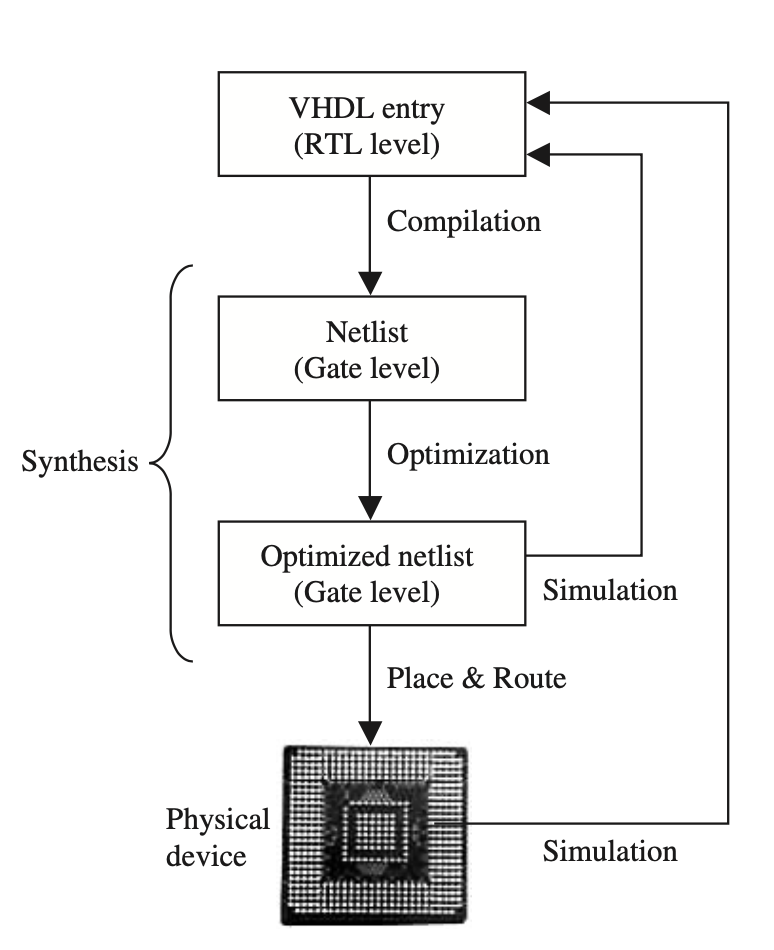

VHDL  برای حل یک مشکل در وزارت دفاع آمریکا ساخته شد . مشکل از جایی شروع شد که اونها با تیم های زیادی کار میکردن و هرکدوم از اون تیمها از یک زبان برای توصیف سخت‌افزار طراحی شده استفاده میکردن، این موضوع باعث میشده که انتقال این طرح از تیمی به تیم دیگه کار بسیار دشواری بشه. همچنین نگهداری از این طرح های سخت‌افزاری هم کار دشواری بود، زیرا مشخص نبود زبانی که از آن برای توصیف سخت‌افزار استفاده شده در آینده همچنان پشتیبانی میشود یا خیر.

VHDL  هم برای سنتز کردن (syntheses) و هم برای شبیه سازی استفاده میشود. هرچند که VHDL کاملا قابل شبیه‌سازی است، اما همه قسمت های آن قابل سنتز نیستند. 

> **سنتز (synthesis) چیست ؟‌**
>
> به عملیات تبدیل RTL به یک طراحی سخت‌افزار قابل پیاده سازی با گیت های منطقی سنتز کردن(synthesis) میگویند. 
>
> 

مهم ترین کاربرد VHDL در زمینه‌ی دستگاه های  منطقی برنامه پذیر (Programmable Logic Devices) مانند FPGA یا CPLD ها است .

اگر تا به امروز از زبان های معمول برنامه نویسی برای کامپیوتر استفاده کردید باید به این نکته توجه داشته باشید که  این زبان ها به شکل متوالی (sequential) اجرا میشوند در صورتی که در VHDL  دستورات به شکل همزمان اجرا (concurrent) اجرا میشوند . در VHDL تنها زمانی دستورات پشت سر هم اجرا میشوند که در PROCCESS , FUNCTION , PROCEDURE قرار گرفته باشند. 

## روند طراحی

همانطور که در بالا اشاره شد یکی از قابلیت های مهم VDHL توانایی سنتز کردن کد شما به یک برنامه قابل اجرا روی دستگاه های برنامه پذیر (FPGA یا PLD) است. شما میتوانید خلاصه ای از این کار را در **تصویر ۱.۱**  ببنید .

